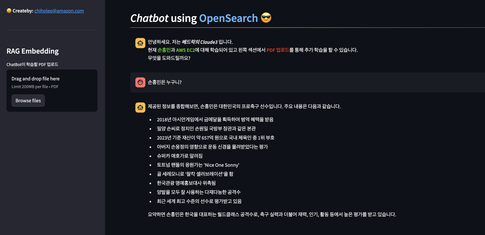

## Preparation in advance
- OpenSearch
- Bedrock
- IAM

## Env File
create .env
```bash
OPENSEARCH_USERNAME=...
OPENSEARCH_PASSWORD=...
OPENSEARCH_ENDPOINT=...
OPENSEARCH_INDEX_NAME=...
MYSQL_HOST=...
MYSQL_PORT=...
MYSQL_USER=...
MYSQL_PASSWORD=...
MYSQL_DB=...
```

## Execution
```bash
python3.10 -m virtualenv venv
source ./venv/bin/activate
pip install -r requirements.txt
export AWS_DEFAULT_REGION='us-west-2'
streamlit run app.py --server.port 8501
```

## Img
